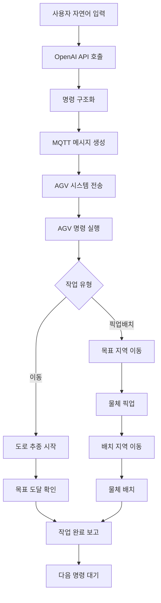

# 🤖 Pick & Place AGV System

지능형 물체 인식 및 운반 자동화 시스템 - AI 기반 자율주행 무인운반차량(AGV)

## 📋 프로젝트 개요

Pick & Place AGV는 컴퓨터 비전과 딥러닝 기술을 활용하여 지정된 색상의 작업 영역을 자동으로 인식하고 이동하는 스마트 무인운반차량입니다. JetBot 플랫폼 기반으로 구축되어 실시간 도로 추종, 색상 기반 목표 지점 인식, MQTT 통신을 통한 원격 제어가 가능합니다.

### 주요 기능

- **🛣️ AI 기반 자율주행**: ResNet-18 딥러닝 모델을 활용한 실시간 도로 추종
- **🎯 색상 기반 영역 인식**: 6가지 색상(빨강, 초록, 파랑, 보라, 노랑, 주황) 영역 자동 감지
- **🧠 자연어 명령 처리**: OpenAI API를 활용한 자연어 명령 해석 및 실행
- **🖥️ 직관적 GUI 제어**: 사용자 친화적 그래픽 인터페이스를 통한 간편한 제어
- **📡 MQTT 원격 제어**: 실시간 명령 수신 및 카메라 스트리밍
- **🔄 자동 순환 운행**: A지점과 B지점 간 무한 순환 이동
- **📹 실시간 모니터링**: 라이브 카메라 피드 및 상태 정보 전송

## 🏗️ 시스템 아키텍처

### 1. 하드웨어 구성
- **JetBot 플랫폼**: NVIDIA Jetson Nano 기반 모바일 로봇
- **카메라 모듈**: 실시간 영상 처리 및 환경 인식
- **모터 시스템**: 좌우 독립 제어를 통한 정밀 주행
- **무선 통신**: WiFi 기반 MQTT 통신

### 2. 소프트웨어 구성
```
📦 Pick & Place AGV
├── 🧠 AI 모듈
│   ├── ResNet-18 도로 추종 모델
│   ├── OpenCV 색상 인식
│   └── OpenAI API 자연어 처리
├── 🖥️ GUI 모듈
│   ├── 사용자 인터페이스
│   ├── 자연어 명령 입력
│   └── 실시간 상태 모니터링
├── 🎮 제어 모듈
│   ├── 모터 제어 (PID)
│   ├── 경로 계획
│   └── 명령 해석 엔진
├── 📡 통신 모듈
│   ├── MQTT 클라이언트
│   └── 실시간 스트리밍
└── 🎯 미션 모듈
    ├── 영역 탐지
    ├── 물체 픽업/배치
    └── 순환 운행
```

## 🔧 핵심 기술

### AI/딥러닝
- **ResNet-18 네트워크**: 사전 훈련된 도로 추종 모델
- **OpenAI GPT**: 자연어 명령 해석 및 구조화된 명령 생성
- **실시간 추론**: CUDA GPU 가속을 통한 고속 처리
- **PID 제어**: 조향각 계산 및 모터 제어 최적화

### 통신 시스템
- **HSV 색상 공간**: 조명 변화에 강인한 색상 인식
- **모폴로지 연산**: 노이즈 제거 및 객체 정제
- **컨투어 분석**: 목표 영역의 중심점 계산

### 자연어 처리
- **OpenAI API 연동**: GPT 모델을 활용한 자연어 이해
- **명령 파싱**: 복잡한 작업 지시를 구조화된 명령으로 변환
- **의도 분석**: 사용자 의도 파악 및 적절한 액션 매핑
- **오류 처리**: 모호한 명령에 대한 명확화 요청
- **MQTT 프로토콜**: 경량화된 IoT 통신
- **Base64 인코딩**: 실시간 이미지 스트리밍
- **JSON 메시지**: 구조화된 명령 전송

## 🚀 설치 및 실행

### 시스템 요구사항
```bash
# 하드웨어
- NVIDIA Jetson Nano (4GB 권장)
- JetBot 키트
- MicroSD 카드 (32GB 이상)
- WiFi 연결

# 소프트웨어
- JetPack 4.6
- Python 3.6+
- PyTorch 1.9+
- OpenCV 4.x
```

### 설치 방법
```bash
# 저장소 클론
git clone https://github.com/Hwanseong0125/Pick_Place_AGV.git
cd Pick_Place_AGV

# 의존성 설치
pip install -r requirements.txt

# JetBot 라이브러리 설치
sudo apt-get update
sudo apt-get install python3-pip
pip3 install jetbot

# PyTorch 설치 (Jetson Nano용)
wget https://nvidia.box.com/shared/static/fjtbno0vpo676a25cgvuqc1wty0fkkg6.whl -O torch-1.10.0-cp36-cp36m-linux_aarch64.whl
pip3 install torch-1.10.0-cp36-cp36m-linux_aarch64.whl

# 추가 패키지
pip3 install paho-mqtt opencv-python torchvision
pip3 install openai requests tkinter  # GUI 및 OpenAI API용
pip3 install python-dotenv  # 환경변수 관리용
```

### 설정
```python
# AGVPJT.py에서 MQTT 브로커 설정
address = "YOUR_MQTT_BROKER_IP"  # 라즈베리파이 또는 MQTT 브로커 IP
port = 1883

# OpenAI API 키 설정 (.env 파일 생성)
echo "OPENAI_API_KEY=your_openai_api_key_here" > .env

# 작업 영역 색상 설정 (필요시 조정)
colors = [
    {'name': 'red',    'lower': np.array([3, 139, 181]),  'upper': np.array([80, 145, 220])},
    {'name': 'green',  'lower': np.array([40, 50, 50]),   'upper': np.array([90, 255, 255])},
    # ... 기타 색상
]
```

### 실행
```bash
# AGV 시스템 시작
python3 AGVPJT.py

# GUI 컨트롤러 시작 (별도 터미널)
python3 gui_controller.py

# 자연어 명령 예시 (GUI에서 입력)
"빨간색 지역에 가서 박스를 들고 파란색 지역에 내려놔줘"
"A지점으로 이동해서 물품을 픽업하고 B지점에 배치해줘"
"녹색 영역에서 부품을 가져와서 노란색 영역에 놓아줘"

# 기존 MQTT 명령도 여전히 사용 가능
mosquitto_pub -h YOUR_BROKER_IP -t "AGV/command" -m '{"cmd_string": "Area", "arg_string1": "red", "arg_string2": "blue"}'
```

## 🎮 제어 명령어

### MQTT 명령 구조
```json
{
    "cmd_string": "명령어",
    "arg_string1": "매개변수1",
    "arg_string2": "매개변수2"
}
```

### 지원 명령어
| 명령어 | 설명 | 매개변수 | 자연어 예시 |
|--------|------|----------|-------------|
| `go` | 전진 | - | "앞으로 가줘" |
| `back` | 후진 | - | "뒤로 가줘" |
| `left` | 좌회전 | - | "왼쪽으로 돌아줘" |
| `right` | 우회전 | - | "오른쪽으로 돌아줘" |
| `mid` / `stop` | 정지 | - | "멈춰줘" |
| `Area` | 영역 순환 모드 | `arg1`: 시작 색상, `arg2`: 목표 색상 | "빨간색에서 파란색으로 가줘" |
| `PickPlace` | 픽업&배치 작업 | `pickup_area`: 픽업 지역, `place_area`: 배치 지역, `item`: 물품명 | "A지역에서 박스 들고 B지역에 놓아줘" |
| `exit` | 시스템 종료 | - | "작업 종료해줘" |

### 사용 예시

#### 자연어 명령 (GUI 인터페이스)
```
사용자: "빨간색 지역에 가서 박스를 들고 파란색 지역에 내려놔줘"
AI 해석: {"cmd_string": "PickPlace", "pickup_area": "red", "place_area": "blue", "item": "박스"}

사용자: "A구역으로 이동해서 부품을 픽업하고 B구역에 배치해줘"
AI 해석: {"cmd_string": "PickPlace", "pickup_area": "green", "place_area": "yellow", "item": "부품"}

사용자: "작업 중단하고 정지해줘"
AI 해석: {"cmd_string": "stop"}
```

#### 기존 MQTT 명령
```bash
# 빨간색과 파란색 영역 간 순환 이동
mosquitto_pub -h 192.168.1.100 -t "AGV/command" -m '{"cmd_string": "Area", "arg_string1": "red", "arg_string2": "blue"}'

# 수동 제어
mosquitto_pub -h 192.168.1.100 -t "AGV/command" -m '{"cmd_string": "go"}'
mosquitto_pub -h 192.168.1.100 -t "AGV/command" -m '{"cmd_string": "stop"}'
```

## 📊 시스템 동작 플로우



## 🎯 주요 기능 상세

### 1. 도로 추종 (Road Following)
- **AI 모델**: ResNet-18 기반 회귀 모델
- **입력**: 224x224 RGB 이미지
- **출력**: (x, y) 좌표 - 도로 중심선 방향
- **제어**: PID 기반 조향각 계산

### 2. 색상 영역 인식
- **색상 공간**: BGR → HSV 변환
- **전처리**: 가우시안 블러, 모폴로지 연산
- **검출**: 컨투어 분석 및 최대 영역 추출
- **정확도**: 중심점 기준 ±20 픽셀 오차 허용

### 4. 자연어 명령 처리 시스템
- **사용자 인터페이스**: 직관적인 GUI를 통한 자연어 명령 입력
- **OpenAI 연동**: GPT 모델을 활용한 명령 해석 및 구조화
- **의미 분석**: "A지역에서 B지역으로", "박스를 들어서" 등의 복잡한 지시 처리
- **명령 검증**: 실행 가능한 명령인지 사전 검증

#### 지원하는 자연어 패턴
```
✅ 이동 명령: "빨간색 지역으로 가줘"
✅ 픽업 명령: "A구역에서 박스를 들어줘"  
✅ 배치 명령: "B지역에 물건을 내려놔줘"
✅ 복합 명령: "초록색에서 부품 들고 노란색에 놓아줘"
✅ 제어 명령: "멈춰줘", "작업 중단해줘"
```
- **토픽 구조**:
  - `AGV/command`: 명령 수신
  - `AGV/sensing`: 상태 정보 전송
  - `robot/camera`: 실시간 영상 스트리밍
- **QoS**: Level 1 (최소 1회 전달 보장)

### 5. MQTT 통신

## 📈 성능 지표

- **주행 속도**: 최대 0.4m/s
- **인식 거리**: 카메라 기준 50cm ~ 2m
- **색상 인식 정확도**: 95% 이상
- **자연어 명령 처리**: 평균 2초 이내
- **명령 해석 정확도**: 90% 이상
- **실시간 처리**: 10 FPS
- **통신 지연**: 100ms 이하

## 🎯 자연어 명령 사용 가이드

### GUI 인터페이스 사용법
1. **GUI 컨트롤러 실행**: `python3 gui_controller.py`
2. **OpenAI API 키 입력**: 설정 섹션에 API 키 등록
3. **MQTT 연결**: AGV와 연결 확인
4. **자연어 명령 입력**: 텍스트 박스에 원하는 작업 입력
5. **실행 확인**: 실시간 상태 모니터링

### 효과적인 명령 작성 팁
- **명확한 지시**: "빨간색 지역에서 파란색 지역으로"
- **구체적인 물품명**: "박스", "부품", "패키지" 등
- **단계별 지시**: "먼저 A지역으로 가서, 그 다음 물건을 들어"
- **간단한 문장**: 복잡한 문장보다는 명확하고 간단한 지시

### 명령 예시집
```
📦 물류 작업:
- "창고 A에서 상품박스 가져와서 출하구역에 놓아줘"
- "빨간색 구역의 부품을 초록색 조립라인으로 이동해줘"

🏭 제조업 작업:
- "원자재 보관소에서 재료 픽업하고 가공라인에 공급해줘"
- "완제품을 포장라인에서 가져와 출고대기구역으로 이동"

🔧 일반 작업:
- "도구함에서 공구 가져와서 작업대에 놓아줘"
- "검사완료 제품을 품질관리실로 운반해줘"
```

## 🔮 확장 계획

- [ ] **고급 자연어 처리**: 더 복잡한 다단계 작업 명령 지원
- [ ] **음성 인터페이스**: STT를 통한 음성 명령 처리
- [ ] **다중 AGV 협업**: "AGV1은 A구역으로, AGV2는 B구역으로" 등 다중 로봇 제어
- [ ] **학습 기능**: 사용자 명령 패턴 학습을 통한 개인화된 명령 처리
- [ ] **동적 장애물 회피**: LIDAR 센서 통합
- [ ] **웹 대시보드**: 실시간 모니터링 UI
- [ ] **물체 픽업**: 로봇팔 통합 시스템
- [ ] **작업 스케줄링**: 복수의 작업을 순서대로 처리하는 큐 시스템

## 🛠️ 기술 스택

### 하드웨어
- **플랫폼**: NVIDIA Jetson Nano
- **로봇**: JetBot
- **센서**: CSI 카메라, IMU
- **액추에이터**: DC 기어드 모터

### 소프트웨어
- **OS**: Ubuntu 18.04 (JetPack)
- **언어**: Python 3.6
- **AI 프레임워크**: PyTorch 1.9
- **자연어 처리**: OpenAI GPT API
- **GUI**: Tkinter
- **비전**: OpenCV 4.x
- **통신**: Paho MQTT
- **기타**: NumPy, PIL, Base64, Requests

## 🚨 안전 주의사항

⚠️ **운영 전 필수 확인사항**
- 주행 경로에 장애물이 없는지 확인
- 비상 정지 명령 준비 (`stop` 또는 `exit`)
- 카메라 렌즈 청결 상태 점검
- 배터리 충전 상태 확인 (최소 50% 이상)

## 🐛 문제 해결

### 일반적인 문제들

**AGV가 직진하지 못할 때**
```bash
# 모델 재로드
python3 -c "import torch; model = torch.load('model'); print('Model loaded successfully')"
```

**색상 인식이 안될 때**
- 조명 환경 확인
- HSV 임계값 조정
- 카메라 초점 맞춤

**자연어 명령이 처리되지 않을 때**
```bash
# OpenAI API 키 확인
echo $OPENAI_API_KEY

# API 연결 테스트
curl -H "Authorization: Bearer YOUR_API_KEY" https://api.openai.com/v1/models

# GUI 로그 확인
tail -f gui_controller.log
```

**GUI가 실행되지 않을 때**
```bash
# Tkinter 설치 확인
python3 -c "import tkinter; print('Tkinter available')"

# 디스플레이 환경 확인 (원격 접속시)
export DISPLAY=:0
```
```bash
# 네트워크 연결 확인
ping YOUR_BROKER_IP

# 방화벽 설정 확인
sudo ufw status
```

**MQTT 연결 실패시**

이 프로젝트는 MIT 라이선스 하에 공개되어 있습니다.

## 🤝 기여하기

1. Fork the Project
2. Create your Feature Branch (`git checkout -b feature/AmazingFeature`)
3. Commit your Changes (`git commit -m 'Add some AmazingFeature'`)
4. Push to the Branch (`git push origin feature/AmazingFeature`)
5. Open a Pull Request

## 📞 문의 및 지원

- **Issues**: GitHub Issues 탭 활용
- **기술 문의**: Discussions 섹션
- **긴급 문제**: hwanseong0125@gmail.com

---

🤖 **스마트 팩토리의 미래를 만들어가는 AGV 시스템**

[](https://choosealicense.com/licenses/mit/)
[](https://www.python.org/downloads/)
[](https://pytorch.org/)
[](https://jetbot.org/)
